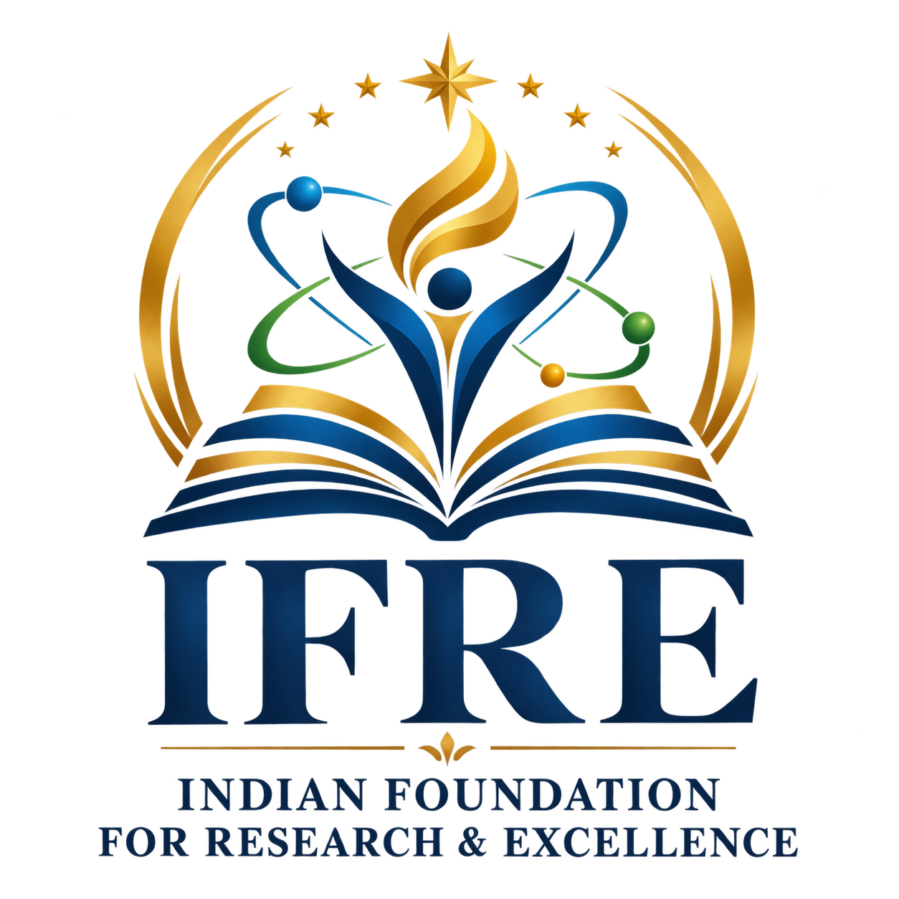

# IFRE — Indian Foundation for Research & Excellence

A national platform for academic recognition, honoring India's finest students, teachers, researchers, scholars, and academic leaders.

---

## 🌟 About

**Indian Foundation for Research & Excellence (IFRE)** is an academic recognition organization dedicated to identifying, honoring, and celebrating outstanding contributions by students, teachers, researchers, scholars, and academic leaders across India.

We believe meaningful recognition encourages excellence, inspires future generations, and brings visibility to individuals who contribute to education, research, innovation, and academic development.

---

## 🎯 Our Mission

To identify and recognize outstanding achievements in education, research, scholarship, innovation, and academic leadership — and to encourage a culture of excellence by offering meaningful recognition to those who contribute to knowledge and society.

## 🌠 Our Vision

To become a trusted national platform for academic recognition — connecting and celebrating individuals who contribute to India's education, research, and knowledge ecosystem.

---

## 🏆 Awards

### 🎓 Student Excellence Awards
- Academic Excellence Award (M.Tech)
- Extended Learning Excellence Award (M.Tech)
- Professional Excellence Award (M.Tech)
- Best Student Award – Undergraduate (UG)
- Best Student Award – Postgraduate (PG)
- Best Engineering Student Award – B.Tech / B.E.
- Best Engineering Student Award – M.Tech / M.E.
- Best Research Scholar Award – Ph.D.
- Outstanding Post-Doctoral Fellow Award
- Best Project Award – UG / PG
- Best Innovation Award – Student
- Best Paper Presentation Award – Student
- Outstanding Student Leadership Award

### 👨‍🏫 Faculty Excellence Awards
- Best School Teacher Award
- Best Young Faculty Award
- Best Senior Faculty Award
- Best Women Faculty Award
- Best Faculty Mentor Award
- Outstanding Faculty Mentor Award
- Distinguished Professor Award
- Rising Star Award
- Lifetime Achievement Award

### 🔬 Research Excellence Awards
- Award of Excellence in Research
- Best Young Researcher Award
- Best Researcher Award
- Best Senior Researcher Award
- Best Young Scientist Award
- Best Senior Scientist Award
- Best Women Scientist Award
- Best Research Supervisor Award
- Post-Doctoral Mentoring Award

### 🏛️ Academic Leadership Awards
- Best School Principal Award
- Best College Principal Award
- Best Head of Department (HOD) Award
- Best Dean Award
- Best Academic Leadership Award

### 🎖️ Specialized Awards
- Nursing Practice Excellence Award

---

## 🛠️ Tech Stack

- **Frontend:** HTML5, CSS3, JavaScript (Vanilla)
- **Backend:** Google Apps Script
- **Database:** Google Sheets
- **File Storage:** Google Drive
- **Fonts:** Inter, Playfair Display, Great Vibes
- **Email:** Gmail via Apps Script MailApp

---

## 📂 Project Structure
ifre-website/
├── index.html # Home
├── about.html # About Us
├── awards.html # All awards (accordion)
├── apply.html # Registration form
├── benefits.html # Award benefits
├── gallery.html # Award winners + ceremony photos
├── verify.html # Certificate verification
├── contact.html # Contact form
├── css/
│ └── style.css # Master stylesheet
├── js/
│ ├── layout.js # Common header + footer
│ └── verify.js # Certificate verification
├── assets/ # Logos, ISO badge, seal, signature
├── awardwinners/ # Winner posters
├── ceremony/ # Ceremony photos
├── certificatehtml/ # Individual award certificates
└── certificates/ # (legacy) PDF certificates

---

## 🚀 Features

- ✅ **Fully responsive** — works on mobile, tablet, and desktop
- ✅ **Free application form** — Google Sheets + Drive integration
- ✅ **Auto-generated registration IDs** — `IFRE2026XXXXX`
- ✅ **Certificate verification** — verify by ID online
- ✅ **Photo + Resume upload** — stored in organized Drive folders
- ✅ **Admin email notifications** — every application lands in Gmail
- ✅ **Accordion award categories** — clean, expandable layout
- ✅ **Gallery sections** — award winners + ceremony photos
- ✅ **Contact form** — messages delivered to Gmail

---

## 📞 Contact

- **WhatsApp:** [+91 9503593997](https://wa.me/919503593997)
- **Email:** [ifreceo@gmail.com](mailto:ifreceo@gmail.com)
- **Location:** Nellore, Andhra Pradesh, India – 524305

---

## 🏅 Certifications

- 🇮🇳 **Udyam Registered** — UDYAM-AP-08-0132430
- 🏅 **ISO 9001:2015 Certified**

---

## 📄 License

© 2026 Indian Foundation for Research & Excellence. All Rights Reserved.

---

**Recognizing Achievement. Inspiring Excellence.**